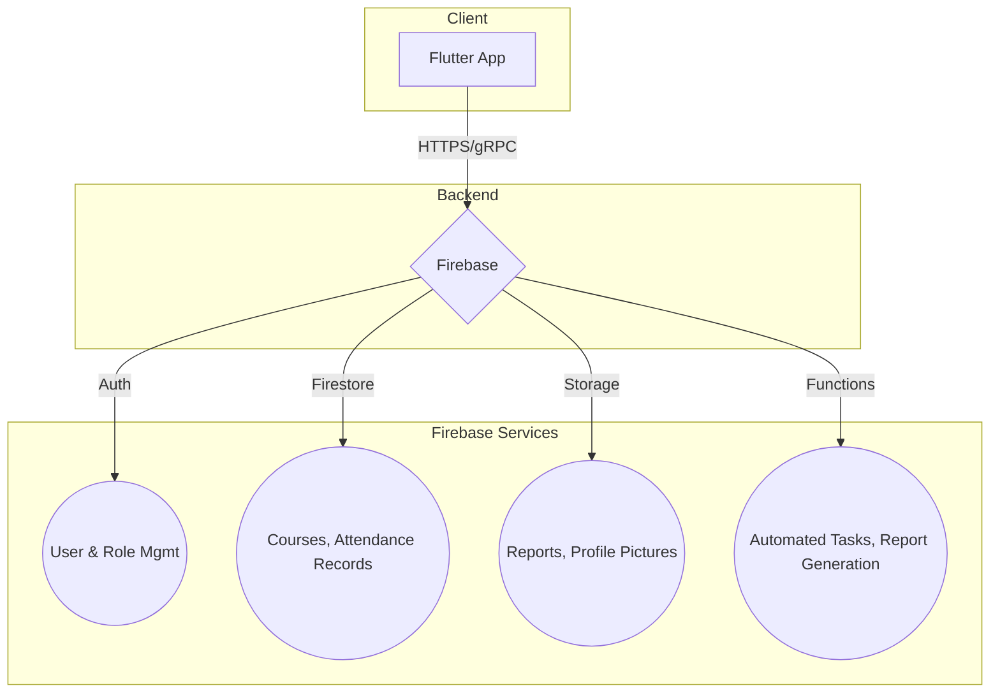

# JKUAT Attendance App

A modern, efficient, and reliable solution for managing and tracking class attendance at Jomo Kenyatta University of Agriculture and Technology (JKUAT).

## Overview

This Flutter-based mobile application aims to replace traditional paper-based attendance systems with a streamlined digital process. Lecturers can easily create and manage class sessions, while students can quickly mark their attendance, typically through QR code scanning. The system will provide real-time data, generate attendance reports, and reduce administrative overhead.

##  Planned Features

-   **User Roles:**
    -   **Student:** View registered courses, mark attendance, and view personal attendance history.
    -   **Lecturer:** Create and manage course sessions, generate attendance reports, and view student attendance for their courses.
    -   **Admin:** Manage user accounts, courses, and system settings.
-   **Attendance Tracking:**
    -   Lecturers generate a unique QR code for each class session.
    -   Students mark their presence by scanning the QR code within the app.
    -   Geolocation and timestamping to ensure integrity.
-   **Reporting:**
    -   Lecturers can generate and export attendance reports (e.g., in PDF or CSV format).
    -   Students can view their own attendance percentage for each course.
-   **Notifications:**
    -   Reminders for upcoming classes.
    -   Alerts for low attendance.
-   **Course Management:**
    -   Admins and lecturers can manage course details and student enrollments.

## Architecture

The application will use a client-server architecture with Flutter as the frontend and Firebase as the backend-as-a-service (BaaS).



## 🛠️ Technical Stack

-   **Frontend:** [Flutter](https://flutter.dev/)
-   **Backend:** [Firebase](https://firebase.google.com/)
    -   **Authentication:** For user sign-up and sign-in.
    -   **Cloud Firestore:** As the primary database for storing data.
    -   **Cloud Storage:** For storing generated reports and other files.
    -   **Cloud Functions:** For backend logic and automated tasks.
-   **State Management:** (To be decided - e.g., Provider, Riverpod)
-   **CI/CD:** GitHub Actions

## 🚀 Getting Started

To get a local copy up and running, follow these simple steps.

### Prerequisites

-   [Flutter SDK](https://docs.flutter.dev/get-started/install)
-   A Firebase project.

### Installation

1.  **Clone the repo:**
    ```sh
    git clone https://github.com/Shelmith-Wendy/Jkuat-attendance-app.git
    ```
2.  **Navigate to the project directory:**
    ```sh
    cd Jkuat-attendance-app
    ```
3.  **Install dependencies:**
    ```sh
    flutter pub get
    ```
4.  **Configure Firebase:**
    -   This project uses Firebase. You will need to set up your own Firebase project and add your `firebase_options.dart` file to the `lib/` directory.
    -   *Note: This file is intentionally not checked into version control for security reasons.*
5.  **Run the app:**
    ```sh
    flutter run
    ```

## 🤝 Contributing

Contributions, issues, and feature requests are welcome! Feel free to check the [issues page](https://github.com/Shelmith-Wendy/Jkuat-attendance-app/issues).

## 📜 License

Distributed under the MIT License. See `LICENSE` for more information.
